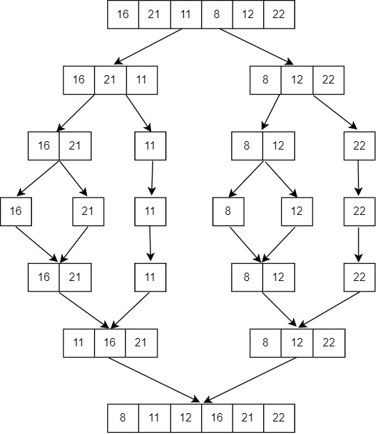

# Merge Sort Projesi
## [16,21,11,8,12,22] -> Merge Sort
### **1.** Yukarıdaki dizinin sort türüne göre aşamalarını yazınız. 

### **2.** Big-O gösterimini yazınız.

- Worst Case Time Complexity [Big-O]: $O(n*log n)$

- Best Case Time Complexity [Big-omega]: $O(n*log n)$

- Average Time Complexity [Big-theta]: $O(n*log n)$
